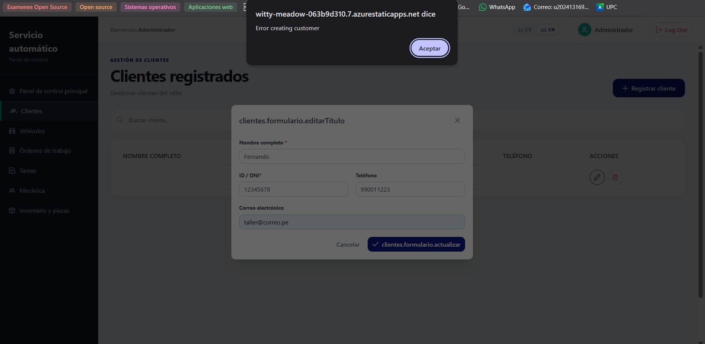
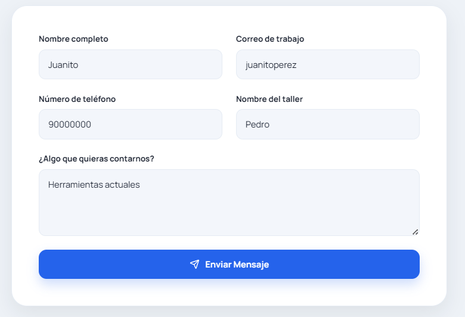
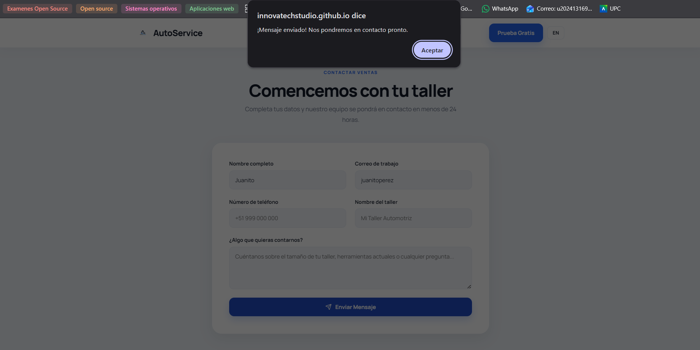
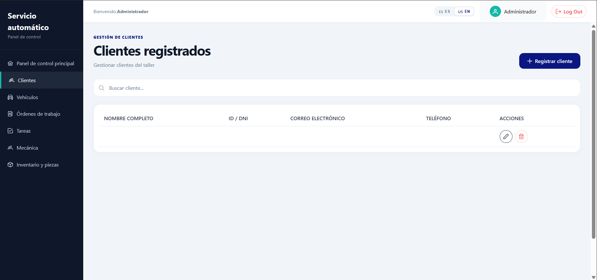
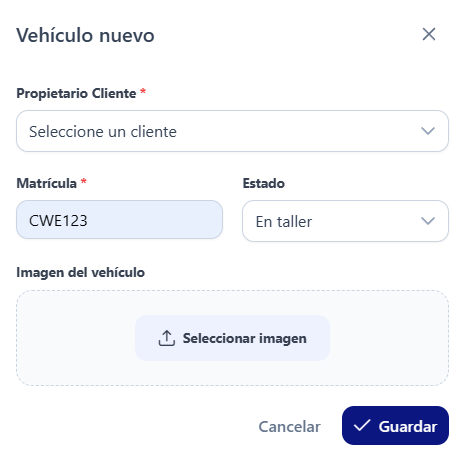
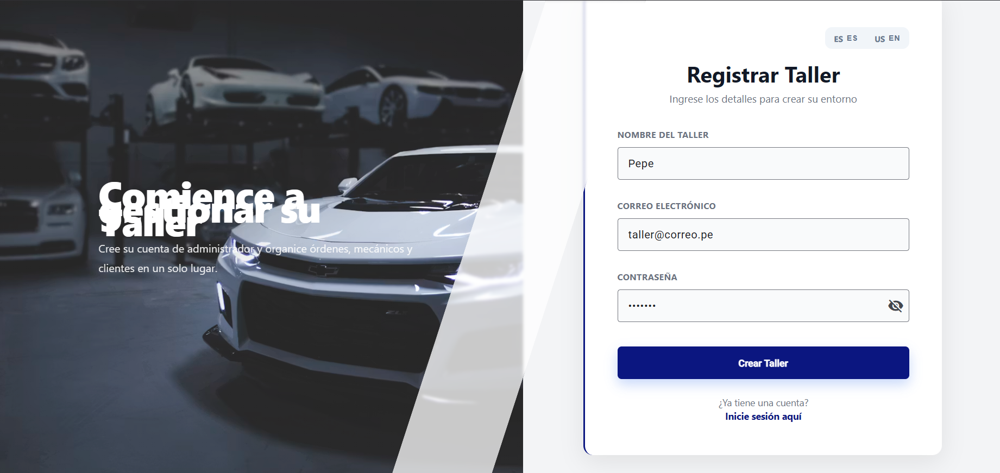
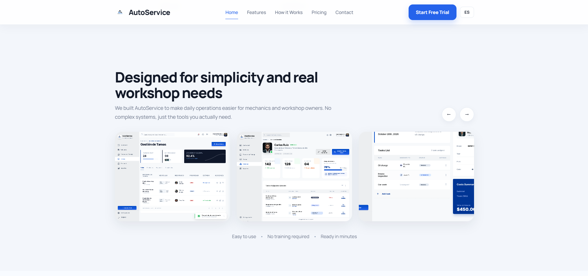
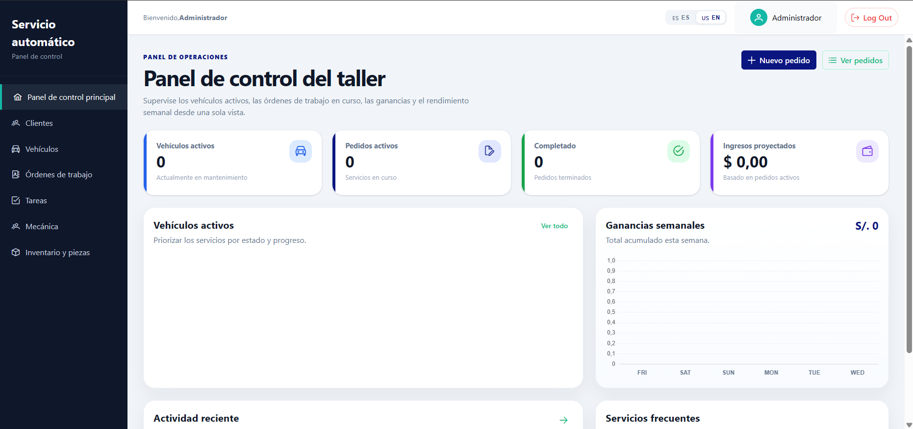
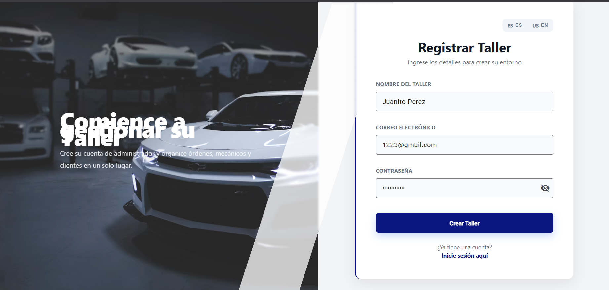

# UX Heuristics & Principles Evaluation
## Usability – Inclusive Design – Information Architecture
 
---
 
| Campo | Detalle |
|---|---|
| **CARRERA** | Ingeniería de Software |
| **CURSO** | Desarrollo de Aplicaciones Open Source |
| **SECCIÓN** | 17952 |
| **PROFESORES** | Todos |
| **AUDITOR** | VitaSync |
| **CLIENTE(S)** | Inovatech — AutoService |
 
---
 
## SITE o APP A EVALUAR
 
**AutoService** — Aplicación Web SaaS  
Plataforma de gestión operativa para talleres automotrices: administración de clientes, vehículos, órdenes de trabajo, tareas, inventario y seguimiento de ganancias, desarrollada por Inovatech.
 
---
 
## TAREAS A EVALUAR
 
El alcance de esta evaluación incluye la revisión de la usabilidad de las siguientes tareas:
 
**Landing Page - Aplicación Web**
1. Navegación entre secciones mediante la barra superior (Inicio, Funciones, Cómo funciona, Precios, Contacto)
2. Cambio de idioma de la landing page (español ↔ inglés)
3. Envío del formulario de contacto ("Comencemos con tu taller")
4. Acceso: Registro de un nuevo taller (pantalla "Registrar Taller")
5. Acceso: Inicio de sesión con cuenta existente
6. Dashborad: Consulta del resumen operativo (vehículos activos, pedidos, ingresos proyectados, ganancias semanales)
7. Gestión de Clientes: Registro de un nuevo cliente
8. Gestión de Clientes: Edición de un cliente existente
9. Gestión de Clientes: Eliminación de un cliente existente
10. Gestion de vehículso: Registro de un vehículo nuevo con asignación de propietario
 
**No están incluidas en esta versión de la evaluación las siguientes tareas:**
1. Gestión de órdenes de trabajo y asignación a mecánicos
2. Administración de inventario y piezas
3. Gestión de tareas internas del taller
4. Consulta y exportación de reportes de rendimiento
5. Configuración de perfil de taller y datos de facturación
---
 
## ESCALA DE SEVERIDAD
 
Los errores serán puntuados tomando en cuenta la siguiente escala de severidad:
 
| Nivel | Descripción |
|---|---|
| **1** | Problema superficial: puede ser fácilmente superado por el usuario o ocurre con muy poca frecuencia. No necesita ser arreglado a no ser que exista disponibilidad de tiempo. |
| **2** | Problema menor: puede ocurrir un poco más frecuentemente o es un poco más difícil de superar para el usuario. Se le debería asignar una prioridad baja resolverlo de cara al siguiente release. |
| **3** | Problema mayor: ocurre frecuentemente o los usuarios no son capaces de resolverlos. Es importante que sean corregidos y se les debe asignar una prioridad alta. |
| **4** | Problema muy grave: un error de gran impacto que impide al usuario continuar con el uso de la herramienta. Es imperativo que sea corregido antes del lanzamiento. |
 
---
 
## TABLA RESUMEN
 
| # | Problema | Escala de Severidad | Heurística / Principio Violado |
|---|---|---|---|
| 1 | Los modales de edición y eliminación de clientes muestran claves i18n sin traducir como texto visible, y los errores del sistema se exponen en inglés mediante alertas nativas del navegador | 4 | Usability: Ayuda a reconocer, diagnosticar y recuperarse de errores |
| 2 | La función de cambio de idioma (ES/EN) en la aplicación web está completamente no operativa: al seleccionar inglés, toda la interfaz permanece en español | 4 | Usability: Consistencia y estándares |
| 3 | El formulario de contacto de la landing page no valida el formato del correo electrónico y permite el envío exitoso con datos inválidos | 3 | Usability: Prevención de errores |
| 4 | El formulario de registro de clientes no valida campos obligatorios y permite crear registros completamente vacíos en el sistema | 3 | Usability: Prevención de errores |
| 5 | El campo "Propietario Cliente" en el formulario de vehículo nuevo no refleja visualmente el cliente seleccionado, permaneciendo en su estado placeholder | 3 | Usability: Visibilidad del estado del sistema |
| 6 | La pantalla de acceso a la plataforma no ofrece la función "Olvidé mi contraseña", bloqueando al usuario que pierde sus credenciales | 2 | Usability: Control y libertad del usuario |
| 7 | Las imágenes de producto embebidas en la landing page no se traducen al cambiar el idioma a inglés, mostrando contenido en español dentro de una interfaz en inglés | 2 | Usability: Consistencia y estándares |
| 8 | El dashboard mezcla formatos de moneda ($ y S/.) para el mismo contexto y muestra los días del eje X del gráfico de ganancias en inglés cuando la interfaz está en español | 2 | Usability: Coincidencia entre el sistema y el mundo real |
| 9 | El texto del panel izquierdo de la pantalla de registro se superpone sobre la imagen de fondo del vehículo, generando ilegibilidad en el contenido principal | 2 | Usability: Diseño estético y minimalista |
| 10 | La barra de navegación de la landing page no actualiza el ítem activo al hacer scroll entre secciones, solo "Inicio" mantiene el indicador de sección activa | 1 | Usability: Visibilidad del estado del sistema |
 
---
 
## DESCRIPCIÓN DE PROBLEMAS
 
---
 
### PROBLEMA #1: Modales con claves i18n sin traducir y errores técnicos expuestos al usuario
 
**Severidad:** 4
 
**Heurística violada:** Usabilidad — Ayuda a reconocer, diagnosticar y recuperarse de errores
 
**Problema:**
 
Al intentar **editar un cliente** desde la vista "Clientes registrados", el sistema despliega un modal cuyo título muestra la cadena sin traducir **`clientes.formulario.editarTítulo`** en lugar del texto legible correspondiente. El botón de confirmación también muestra la clave cruda **`clientes.formulario.actualizar`**. Simultáneamente, una alerta nativa del navegador proveniente de la URL interna de Azure (`witty-meadow-063b9d310.7.azurestaticapps.net dice: Error creating customer`) expone tanto la infraestructura técnica del sistema como un mensaje de error en inglés cuando la interfaz opera en español.
 
El mismo patrón se reproduce al intentar **eliminar un cliente**: el modal de confirmación muestra `clientes.eliminar.título`, `clientes.eliminar.descripción`, `clientes.eliminar.cancelar` y `clientes.eliminar.confirma` como texto literal, y la alerta del navegador muestra `Error deleting customer`. Ante este escenario, el usuario no puede comprender qué acción está a punto de confirmar, no sabe si la operación falló o tuvo éxito, y recibe información técnica irrelevante e incomprensible. La combinación de claves de traducción sin resolver y errores en idioma incorrecto impide completamente que el usuario lleve a cabo las operaciones de edición y eliminación.

  
   <i>Evidencia de heurística 1 </i>

 
**Recomendación:**
 
Resolver de forma inmediata las claves de i18n faltantes en los archivos de traducción para todos los modales de la sección de clientes. Los mensajes de error deben reemplazarse por mensajes orientados al usuario en el idioma activo de la interfaz: por ejemplo, *"No se pudo actualizar el cliente. Intenta nuevamente."* Las alertas nativas del navegador (`window.alert`) deben eliminarse y reemplazarse por notificaciones visuales integradas en la interfaz (toasts o banners de error). La URL de Azure y cualquier detalle de infraestructura nunca deben ser visibles al usuario final.
 
---
 
### PROBLEMA #2: Función de cambio de idioma no operativa en la aplicación web
 
**Severidad:** 4
 
**Heurística violada:** Usabilidad — Consistencia y estándares
 
**Problema:**
 
La aplicación web ofrece un selector de idioma en la barra superior con las opciones **"ES ES"** y **"US EN"**. Al seleccionar la opción en inglés, el indicador visual cambia ("US EN" queda activo), generando en el usuario la expectativa de que la interfaz cambiará de idioma. Sin embargo, **toda la interfaz permanece completamente en español**: el sidebar muestra "Panel de control principal", "Clientes", "Vehículos", "Órdenes de trabajo", "Tareas", "Mecánica", "Inventario y piezas"; el panel principal muestra "Panel de control del taller", "Vehículos activos", "Pedidos activos", "Completado", "Ingresos proyectados". La función está presente en la interfaz pero no ejecuta ningún cambio real, lo que constituye una promesa rota al usuario. Un usuario angloparlante que acceda al sistema quedará sin ninguna opción funcional para comprender la plataforma. Adicionalmente, la etiqueta del selector en español aparece como "ES ES" en lugar de simplemente "ES", lo que sugiere un error de configuración en el propio componente.

 

  
   <i>Evidencia de heurística 2 </i>

 
**Recomendación:**
 
Implementar correctamente la integración del servicio de i18n en la aplicación web, asegurando que el cambio de idioma en el selector actualice reactivamente todos los textos de la interfaz. Mientras la función no esté operativa, retirar temporalmente el selector de idioma del panel de la aplicación para no generar expectativas falsas. Corregir la etiqueta duplicada "ES ES" a simplemente "ES". Validar que los archivos de traducción para inglés estén completos para todas las vistas del panel.
 
---
 
### PROBLEMA #3: El formulario de contacto de la landing page no valida el correo electrónico ni los campos requeridos
 
**Severidad:** 3
 
**Heurística violada:** Usabilidad — Prevención de errores
 
**Problema:**
 
El formulario de contacto de la landing page ("Comencemos con tu taller") presenta dos fallos críticos de validación que permiten el envío de datos inútiles para el equipo comercial. Primero, el campo **"Correo de trabajo"** acepta valores que no constituyen una dirección de correo válida: se comprobó que el valor `juanitoperez` (sin símbolo @ ni dominio) es aceptado sin ningún mensaje de error. Segundo, el formulario acepta el envío aunque existan campos marcados como requeridos sin completar, desplegando el mensaje **"¡Mensaje enviado! Nos pondremos en contacto pronto."** ante datos incompletos. El resultado es que el equipo de ventas puede recibir solicitudes sin correo de contacto válido, haciendo imposible el seguimiento del prospecto, que es el objetivo principal del formulario.

  

  

  
   <i>Evidencia de heurística 3 </i>

 
**Recomendación:**
 
Implementar validación de formato de correo electrónico con expresión regular estándar en el campo "Correo de trabajo", mostrando un mensaje inline claro antes del envío: *"Ingresa una dirección de correo válida (ej: nombre@empresa.com)."* Agregar validación de campos requeridos que bloquee el envío y resalte visualmente los campos faltantes con borde rojo y etiqueta de error. La validación debe ejecutarse tanto al salir de cada campo (on blur) como al hacer clic en "Enviar Mensaje".
 
---
 
### PROBLEMA #4: El formulario de registro de clientes permite crear entradas completamente vacías
 
**Severidad:** 3
 
**Heurística violada:** Usabilidad — Prevención de errores
 
**Problema:**
 
En la vista "Clientes registrados" de la aplicación web, el flujo de registro de un nuevo cliente no implementa validación de campos obligatorios. Al omitir todos los datos del formulario y confirmar el registro, el sistema crea un registro visible en la tabla con todas las columnas vacías (Nombre completo, ID/DNI, Correo electrónico, Teléfono) pero con los íconos de acción (editar y eliminar) activos. Esto genera entradas fantasma en la base de datos del taller que contaminan el listado de clientes, dificultan la búsqueda y pueden provocar errores en flujos subsecuentes como la asignación de vehículos o la creación de órdenes de trabajo vinculadas a ese cliente vacío.

 

  
   <i>Evidencia de heurística 4 </i>

 
**Recomendación:**
 
Marcar como obligatorios al menos los campos "Nombre completo" e "ID / DNI" en el formulario de nuevo cliente, e implementar validación que bloquee el envío si están vacíos, indicando visualmente los campos faltantes. Complementariamente, agregar validación de formato para el DNI (solo numérico, longitud específica según país) y para el correo electrónico si se ingresa. En el backend, agregar restricciones de integridad que rechacen registros sin nombre e identificación.
 
---
 
### PROBLEMA #5: El campo "Propietario Cliente" no refleja la selección realizada en el formulario de vehículo nuevo
 
**Severidad:** 3
 
**Heurística violada:** Usabilidad — Visibilidad del estado del sistema
 
**Problema:**
 
En el modal "Vehículo nuevo", el campo obligatorio **"Propietario Cliente \*"** se presenta como un dropdown con el placeholder "Seleccione un cliente". Tras seleccionar un cliente del listado, el campo debería actualizar su texto para mostrar el nombre del cliente seleccionado, confirmando visualmente al usuario que la asignación fue realizada. Sin embargo, el campo continúa mostrando el texto placeholder **"Seleccione un cliente"** incluso después de haber realizado la selección, sin ninguna retroalimentación visual que indique qué propietario quedó asignado. El usuario queda en un estado de incertidumbre sobre si la selección fue registrada, lo que puede llevar a intentar seleccionar nuevamente o a guardar el vehículo creyendo que el propietario está asignado cuando en realidad puede no estarlo.

  

  
   <i>Evidencia de heurística 5 </i>

 
**Recomendación:**
 
Corregir el binding reactivo del componente dropdown para que actualice el valor mostrado inmediatamente tras la selección del usuario. El campo debe reflejar el nombre completo del cliente elegido (ej.: "Carlos Ruiz") de forma instantánea. Adicionalmente, considerar agregar un ícono de verificación (✓) o resaltado visual al campo para confirmar que el valor fue capturado correctamente, dado que es un campo marcado como requerido.
 
---
 
### PROBLEMA #6: Ausencia de la función "Olvidé mi contraseña" en la pantalla de acceso
 
**Severidad:** 2
 
**Heurística violada:** Usabilidad — Control y libertad del usuario
 
**Problema:**
 
La pantalla de acceso a la plataforma ("Registrar Taller" / inicio de sesión) no ofrece ninguna opción de recuperación de contraseña. Un usuario que haya olvidado sus credenciales no tiene ningún camino disponible dentro de la aplicación para recuperar el acceso a su cuenta, quedando completamente bloqueado sin una salida de emergencia. En aplicaciones SaaS de gestión empresarial, donde el acceso puede ser crítico para la operación diaria de un taller, la ausencia de este mecanismo puede resultar en pérdida permanente de acceso a datos y en la necesidad de contactar soporte técnico para una acción que debería ser autoservicio.

   

  
   <i>Evidencia de heurística 6 </i>

**Recomendación:**
 
Implementar un flujo estándar de recuperación de contraseña: agregar un enlace "¿Olvidaste tu contraseña?" debajo del campo de contraseña en la pantalla de inicio de sesión, que redirija a una vista donde el usuario ingrese su correo registrado y reciba un enlace de restablecimiento por correo electrónico. La implementación debe incluir validación del correo ingresado y un mensaje de confirmación genérico por seguridad: *"Si ese correo está registrado, recibirás un enlace de recuperación en los próximos minutos."*
 
---
 
### PROBLEMA #7: Las imágenes de producto en la landing page no se traducen al cambiar el idioma
 
**Severidad:** 2
 
**Heurística violada:** Usabilidad — Consistencia y estándares
 
**Problema:**
 
Al cambiar el idioma de la landing page a inglés, los textos del navbar y secciones de la página se traducen correctamente ("Home", "Features", "How it Works", "Pricing", "Contact", "Start Free Trial"). Sin embargo, las **capturas de pantalla del producto** embebidas en la sección "Designed for simplicity and real workshop needs" siguen mostrando la interfaz en español: se puede leer claramente **"Gestión de Tareas"** en el screenshot del panel de administración de la aplicación. Esto rompe la coherencia de la experiencia en inglés y genera una disonancia visual que puede hacer dudar al visitante angloparlante sobre si el producto realmente soporta su idioma, afectando directamente la credibilidad de la propuesta de valor internacional del producto.

  
   <i>Evidencia de heurística 7 </i>

 
**Recomendación:**
 
Preparar versiones alternativas de las capturas de pantalla del producto con la interfaz en inglés y cargarlas condicionalmente según el idioma activo de la landing. Dado que mantener múltiples sets de imágenes puede ser costoso, una alternativa es usar capturas con la interfaz ya en inglés (una vez que el Problema #2 sea resuelto) como versión única, ya que el producto debería operar correctamente en ambos idiomas.
 
---
 
### PROBLEMA #8: El dashboard mezcla formatos de moneda y muestra días del gráfico en inglés
 
**Severidad:** 2
 
**Heurística violada:** Usabilidad — Coincidencia entre el sistema y el mundo real
 
**Problema:**
 
El panel de control del taller presenta dos inconsistencias relacionadas con la localización de datos monetarios y temporales. Primero, la tarjeta de **"Ingresos proyectados"** muestra el valor en formato `$ 0,00` (usando el símbolo de dólar), mientras que la sección de **"Ganancias semanales"** muestra `S/. 0` (usando el símbolo de sol peruano). Al tratarse del mismo contexto financiero de un solo taller, la mezcla de dos monedas distintas genera confusión sobre en qué divisa opera el sistema. Segundo, el eje X del gráfico de ganancias semanales muestra los días de la semana en inglés: **FRI, SAT, SUN, MON, TUE, WED**, cuando toda la interfaz del dashboard está en español. Esta inconsistencia de idioma en un componente de datos afecta la credibilidad y profesionalidad de la herramienta ante el usuario final.

 

  
   <i>Evidencia de heurística 8 </i>

 
**Recomendación:**
 
Definir un único formato de moneda a nivel de configuración global de la aplicación, idealmente configurable por cada taller según su país (PEN para Perú, por defecto). Aplicar ese formato de manera consistente en todas las vistas monetarias. Para el gráfico de ganancias, configurar el componente de charting con la localización en español (o en el idioma activo de la app), de modo que los días se muestren como "VIE, SÁB, DOM, LUN, MAR, MIÉ" cuando el sistema opera en español.
 
---
 
### PROBLEMA #9: El texto del panel izquierdo de la pantalla de registro se superpone sobre la imagen de fondo
 
**Severidad:** 2
 
**Heurística violada:** Usabilidad — Diseño estético y minimalista
 
**Problema:**
 
La pantalla de acceso a la plataforma está dividida en dos paneles: el izquierdo contiene una imagen de fondo de vehículos con texto superpuesto ("Comience a gestionar su Taller" y el subtítulo explicativo), y el derecho contiene el formulario de registro o inicio de sesión. El texto del panel izquierdo se superpone visualmente con las partes más detalladas de la imagen de vehículos (capós, ventanas, carrocería de colores), generando bajo contraste y haciendo que el mensaje principal sea difícil de leer. La tipografía blanca sobre un fondo con múltiples tonos claros y oscuros no garantiza legibilidad consistente en todo el ancho del panel. Además, los bloques de texto parecen desalineados respecto al centro visual del panel, creando una composición desequilibrada.

  

  
   <i>Evidencia de heurística 9 </i>

 
**Recomendación:**
 
Aplicar una capa de superposición semitransparente oscura (`overlay`) sobre la imagen de fondo del panel izquierdo para garantizar contraste suficiente con el texto blanco (ratio mínimo WCAG 2.1 AA: 4.5:1). Alternativamente, añadir una sombra de texto (`text-shadow`) robusta sobre los títulos. Revisar también el alineamiento vertical y horizontal del texto para que quede centrado en el panel y no compita visualmente con los elementos más complejos de la fotografía de fondo.
 
---
 
### PROBLEMA #10: La barra de navegación de la landing page no actualiza el ítem activo al hacer scroll
 
**Severidad:** 1
 
**Heurística violada:** Usabilidad — Visibilidad del estado del sistema
 
**Problema:**
 
La barra de navegación superior de la landing page ("Inicio", "Funciones", "Cómo funciona", "Precios", "Contacto") mantiene el indicador de sección activa (subrayado azul) únicamente sobre el ítem **"Inicio"** independientemente de la sección de la página en la que se encuentre el usuario. Al hacer scroll hacia las secciones "Funciones", "Cómo funciona", "Precios" o "Contacto", el indicador no se desplaza para reflejar la posición actual de lectura del usuario. Esto priva al visitante de retroalimentación visual sobre su posición dentro de la página, lo cual es especialmente relevante en una landing page de una sola página (one-page) donde la navegación interna por anclas es el mecanismo principal de orientación.

   

  
   <i>Evidencia de heurística 10 </i>

 
**Recomendación:**
 
Implementar detección de sección activa basada en la posición del scroll usando la API `IntersectionObserver`, que aplica la clase CSS activa al ítem del navbar cuya sección ancla esté actualmente en el viewport del usuario. Esta es la técnica estándar para este tipo de navegación y no requiere librerías externas. El indicador visual (subrayado o color) debe actualizarse de forma fluida conforme el usuario hace scroll entre secciones.
